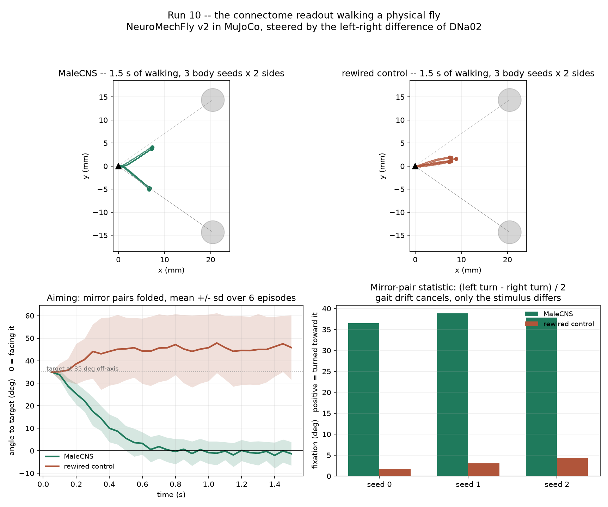
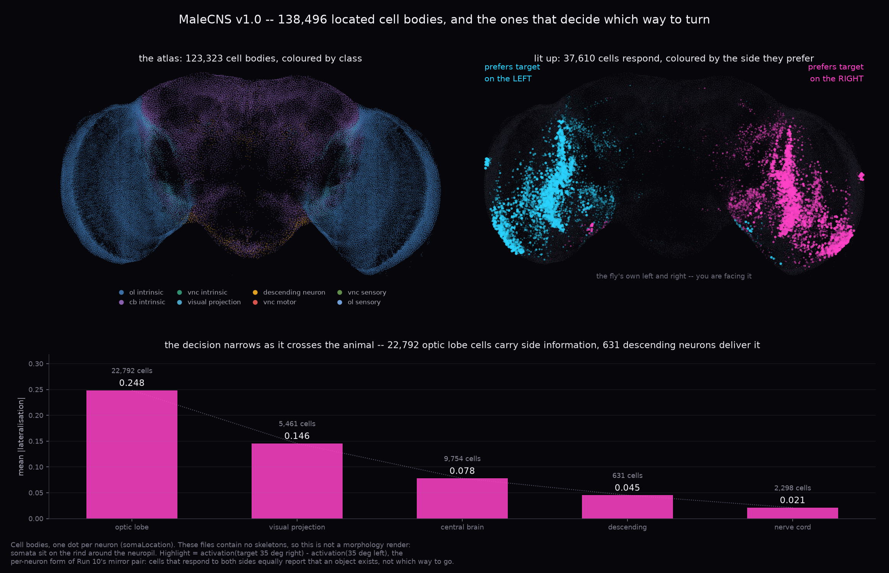

# flyloop

An embodied *Drosophila* sensorimotor loop: a connectome-derived spiking brain
that sees through a compound eye, decides through real descending neurons, and
drives a body.

```
body.observe() -> compound eye -> temporal filter -> Poisson drive
  -> LIF brain -> descending readout -> locomotor command -> body.step()
```

It runs end to end on a laptop, with no GPU and no connectome download, against
a synthetic fixture -- so the plumbing can be tested before the science starts.

## Why another one of these

The June 2026 release of MaleCNS v1.0 produced a wave of projects wiring the fly
connectome into games, browsers and robots. Most of them show the system doing
something impressive and stop there.

This one is built around the opposite question: **how would we know if it isn't
working?** So it ships with control graphs, a non-connectome baseline, and a set
of numbers that make the model's limits explicit.

## Standing on other people's work

The parts of this problem that other people have solved properly are imported,
not rewritten:

| what | from | why |
|---|---|---|
| retinotopy | `connectome-interpreter` (MIT) | bundles the Nern 2024 and Matsliah 2024 columnar tables -- 892 hexagonal columns of MaleCNS, each naming its own L1, L2, Mi1 ... by body ID |
| biomechanical body | `flygym` 2.x | NeuroMechFly v2, plus the measured ommatidial lattice (721 per eye) and the raw-image-to-hex conversion |
| optic lobe | `flyvis` (MIT) | connectome-constrained visual model, *Nature* 2024, with pretrained weights |
| methodology | [`ommatid`](https://github.com/FutureJJ/ommatid) (MIT) | pre-registered hypotheses and shuffled-wiring control graphs, run on real data and real hardware |

**Python version window.** `flygym >= 2.1` needs Python >= 3.12 and `flyvis`
caps at < 3.13, so a full install with both extras must run on **Python 3.12**.
The core package and everything in CI works from 3.10 up.

## Control graphs

A closed loop built on a real connectome will produce *some* behaviour. So will
one built on a graph with the same degree sequence and the wiring shuffled.

```bash
flyloop controls
```

runs the looming experiment on the real graph and on three controls -- rewired
(degrees preserved, targets shuffled), relabelled (topology preserved, cell
identities permuted), and sign-scrambled (transmitters permuted). On the
synthetic fixture:

```
  graph                peak Hz  latency s  escape  carried by
  original               181.3       0.68   100%  DNp04
  rewired                  0.0          -     0%  -
  relabelled              19.3       2.06   100%  DNp02
  signs_scrambled         57.4       2.16   100%  DNp04
```

Note what the controls exposed: **binary escape rate cannot tell these graphs
apart** -- three of the four escape in 100% of trials. Only a continuous
statistic does. That is why the primary measure here is peak escape-population
firing rate rather than a hit count.

## It runs on the real connectome

```bash
GIT_LFS_SKIP_SMUDGE=1 git clone --depth 1 \
    https://github.com/YijieYin/connectome_data_prep ~/connectome_data_prep
flyloop --data-root ~/connectome_data_prep activation --drive LC4 --side L --rate 50
```

MaleCNS v1.0: 161,429 neurons, 5,988,538 connections, 86,516,520 synapses,
loaded in about six seconds. Driving the left LC4 population, the looming
detectors, and reading the descending neurons against three control graphs:

| population | original | rewired | relabelled | signs scrambled |
|---|---:|---:|---:|---:|
| DNp04_L | **325.0** | 0.0 | 0.0 | 350.0 |
| DNp02_L | **225.0** | 0.0 | 0.0 | 305.0 |
| DNp01_L | **195.0** | 0.0 | 0.0 | 355.0 |
| DNp09_L | **0.0** | 0.0 | 0.0 | 285.0 |
| total spikes | 13,324 | 1,594 | 870,981 | 890,053 |

Sweeping the drive from 5 to 200 Hz (`flyloop sweep --control`) settles what a
single rate cannot: **DNp09 is never recruited at any drive strength**, and
DNp01 is simply the last of the three to come in — at weak drive the order is
DNp04 (67.5 Hz) > DNp02 (17.5) > DNp01 (7.5), which is the order ommatid
measured through a camera. On the rewired graph every one of them stays at
0.0 Hz across the whole sweep.

Three things to read off that table, in `docs/RESULTS.md` with the caveats:

- **The response needs the measured wiring.** A degree-preserving rewire kills
  it completely -- every readout at zero.
- **DNp04 and DNp02 carry it; DNp09 is silent.** That reproduces what ommatid
  measured on a robot across 210 trials, from an independent code path.
- **Two of the three controls are unusable at this scale.** Relabelling and
  sign-scrambling push the network into saturation -- ~880,000 spikes against
  13,324 -- so their rates mean nothing. Only the rewired control is
  interpretable. A control that preserves E/I balance per neuron is needed.

## It flies at a target

```bash
flyloop --data-root ~/connectome_data_prep approach --steps 45
```

Starting 23 degrees off-axis, the fly turns to face a dark target and holds it
there — object fixation, the behaviour this circuit is known for. Reward reaches
the plasticity rule addressed to the fly's own PAM cluster (316 dopaminergic
neurons, whose own synapses carry nothing here -- see below), scaled
by closeness, and depresses its own KC→MBON synapses.

| condition | closed | mean \|bearing\| | KC→MBON depression |
|---|---:|---:|---:|
| original, dopamine | 75.1% | **10.8°** | 0.0119 |
| original, no dopamine | 75.1% | **10.8°** | 0.0000 |
| rewired control | 57.0% | **39.5°** | 0.1378 |

Two things to read off that, both in `docs/RESULTS.md`:

- **Fixation needs the measured wiring.** The control still walks forward, so it
  closes distance; what it cannot do is aim.
- **Dopamine changes the weights and not the behaviour** — identical to five
  decimal places. The graph said why first: MBONs supply ~1% of DNa02's input,
  and Kenyon cells barely respond to vision. The mushroom body is an olfactory
  learning centre and is not in the visual steering loop. That is a fact about
  the animal, not a limitation of the code.

## It walks a physical fly

```bash
flyloop --data-root ~/connectome_data_prep embodied --control
```

NeuroMechFly v2 in MuJoCo — 42 actuated joints, tripod gait, contact physics —
steered by the same unfitted readout: the left-right difference of DNa02.

| graph | fixation | commanded turn | mean \|bearing\| |
|---|---:|---:|---:|
| MaleCNS | **+37.7° ± 1.2** | +0.050 | 9.7° |
| rewired control | **+3.0° ± 1.4** | +0.002 | 43.9° |



**The measurement is a mirror pair, and that is not a detail.** Told to walk
straight for 2 s, NeuroMechFly drifts +14.6°, −0.4° and −40.6° on three body
seeds. So each measurement runs one body seed twice — target 35° left, target 35°
right — and takes the difference. Gait noise is common to both and cancels.

Skipping that would have been easy and wrong. Read one-sidedly, the rewired
control looks like it steers: mean |bearing| 43.9° against 9.7°, a clean-looking
4.5× separation. Split by side, its bearing goes −35° → −32.9° on the left and
+35° → **+58.8°** on the right — it never responded to the stimulus at all, both
episodes just drifted left. The mirror statistic reports +3.0°, which is the
honest number.

The connectome supplies a direction and the body supplies the gain: a commanded
turn of 0.050 — 5% of the controller's range — becomes 37.7° of heading once the
gait integrates it. The fly aims in 0.8 s and holds; in 1.5 s it does not arrive.

## It shows you which neurons decided

```bash
flyloop --data-root ~/connectome_data_prep atlas
python docs/figures/plot_atlas.py
```



138,496 cell bodies in the animal's own coordinates, with the cells that decide
*which way to turn* lit up. The highlight is a **difference** — activation with
the object 35° to the right minus its mirror image on the left — because a
neuron that answers both equally is reporting that an object exists, not which
way to go. Same argument as Run 10's mirror pair, one neuron at a time.

Side information is strong at the retina and 5.5× weaker by the descending
neurons (0.248 → 0.045), which is the funnel the animal has to build: 22,792
optic lobe cells cannot each issue a motor command. The ranking picks out PVLP
types — where LC4 and LPLC2 terminate — and **DNp04**, the same unexpected
descending neuron the ommatid project measured carrying looming while the
textbook DNp01 sat silent. Nothing in the analysis was told any of that.

**These are cell bodies, not neurites.** The prepared files contain no
skeletons, and neuPrint and Codex are unreachable from here, so this is not the
morphology render it resembles: somata sit on the rind around the neuropil.

## There is an application

```bash
flyloop --data-root ~/connectome_data_prep record --physics --out app/data --gain 1
python -c "from flyloop.viz.fly_geometry import export_rig; export_rig('app/data')"
python -m http.server 8000 --directory app
```

The fly on the left, posed frame by frame from 42 logged joint angles; its brain
on the right, 138,496 cell bodies coloured by their type's activation; both
scrubbing on one timeline. Record a second episode at another `--gain` and the
player offers a picker, so the same fly under the same stimulus can be compared
with only the strength of the MBON→DNa02 coupling changed.

Three things it says on its face, because they are the result rather than
limitations to be hidden:

- **The gain is always on screen.** At the measured coupling the learned bias
  moves the approach drive by less than a millionth. That is what the anatomy
  says, not a bug to compensate.
- **Playback is not simulation.** One control step costs 1.99 s of wall clock to
  simulate 0.05 s. There is no live mode.
- **The brain panel is cell bodies, not morphology.** The files carry no
  skeletons, so it is a cloud of somata on the rind around the neuropil.

During the training phase the fly is on a rig and its joint angles are NaN. The
player hides the body and shows the mushroom body instead; posing a fly from
NaN draws a corpse sliding across the floor and reads as a physics bug.

### You choose the smell

```bash
flyloop --data-root ~/connectome_data_prep serve
```

`flyloop serve` adds a run endpoint behind the same page, so the stimulus is a
form rather than a command line: bearing, distance, the coupling gain, and
**which glomeruli each of the two odours is made of**, picked from the 53 the
loaded connectome actually has. Rewarding a smell the fly has never been
rewarded for is a selection, not a code change. A run takes about 10 s, because
the 15 s of model building does not depend on what the fly has learned or what
it is looking at, so one loop is kept and only the learning is reset.

Every run reports **how the two odours landed on the Kenyon cells**, and that
number is the one to read before anything else:

| odour | ORNs | Kenyon cells driven |
| --- | ---: | ---: |
| any single glomerulus (nine measured, DA1 down to VM6l) | 204–14 | 0.00–0.07% |
| DM1 + DM4 — the pair this project was built on | 106 | 1.11% |
| DA1 + VA1d | 336 | 0.10% |
| DA1 + VA1d + VA1v + DL3 + VL2a | 667 | 1.48% |

Three times the input, a tenth of the code. What decides it is whether the
chosen glomeruli converge on shared Kenyon cells, which is a fact about the
wiring and cannot be guessed from the names or the sizes. An odour that drives
close to nothing is a smell this fly cannot represent, not one it failed to
learn, and the difference is invisible unless the number is on screen.

## The claims are tested, not just written

```bash
FLYLOOP_DATA_ROOT=~/connectome_data_prep pytest tests/test_claims.py
```

`tests/test_claims.py` asserts the numbers this README and `docs/RESULTS.md`
state, against the live connectomes: the 0.53% MBON→DNa02 junction, the exact
zero from LC4 into Kenyon cells, MBON31 and MBON32 carrying nearly all of it in
both datasets, every glutamatergic neuron signed negative, the PAM cluster's
zero out-degree, and the steering curve's linearity and lean. Seventeen claims,
25 seconds.

It exists because of Run 16. A sentence that had been in five files since Run 6
— that reward "reaches the brain through the fly's own PAM cluster" — turned out
to describe signal flow that does not happen: dopamine is signed 0, so those
316 neurons have no outgoing edges and driving them changes no Kenyon cell by
any amount. No result was affected; the plasticity rule was always what ran. But
the claim survived fifteen runs because **it was never a number**, and nothing
in a test suite compares prose against data.

The net was checked by breaking something on purpose: flipping dopamine's sign
from 0 to 1 fails exactly one test, the one that guards that claim, and leaves
the other sixteen green.

## Quick start

```bash
pip install -e .
flyloop selftest       # end-to-end check on the synthetic fixture
flyloop theory         # model constants and what they imply
flyloop looming        # escape experiment, with controls
flyloop baseline       # the ten-line controller you have to beat
```

`flyloop selftest` should end in `PASS`. It runs the whole loop and the
acceptance experiment in well under a minute.

## What the numbers say before you start

`flyloop theory` prints this, and it is worth internalising:

| quantity | value |
|---|---|
| membrane time constant | 20 ms |
| synaptic time constant | 5 ms |
| firing threshold above rest | 7 mV |
| per-synapse weight `w_syn` | 0.275 mV |
| **peak PSP per unit of `g`** | **0.157** |
| **synapses needed for one spike to fire a resting neuron** | **~162** |

A connectome edge of a few synapses cannot fire anything. Behaviour in this
model comes from populations firing together, which is why reasoning about
individual connectome edges is misleading, and why a readout fitted on top of
160k neurons will always find *something*.

## What this is not

The connectome is a wiring diagram, not a working brain. This model, like the
Shiu et al. model it follows, has:

- no real synaptic strengths -- only synapse counts times one free gain
- no gap junctions
- no neuromodulation (dopamine, octopamine, serotonin), so no hunger, arousal
  or internal state
- no plasticity, no learning
- zero basal firing: an unstimulated network is completely silent

In *Drosophila*, glutamate is predominantly **inhibitory** (GluCl-alpha).
Several community reimplementations treat it as excitatory; the network then
saturates and the authors compensate by tuning the readout until something
moves. `flyloop.connectome.signs` encodes the correct signs and there is a test
pinning it.

If you see a fly-connectome project reporting a "consciousness index" or
"integrated information" for its simulation, that is not a result.

**And the textbook escape pathway may not be the one that fires.** The obvious
design reads escape off DNp01 (the giant fibre) and DNp09. The ommatid project
ran that against real MaleCNS wiring on a hexapod in September 2026 and measured
DNp01, DNp09 and MDN at 0 Hz in all 210 trials, with the looming signal carried
by DNp04 and DNp02 instead. So the escape channel here is a set of populations
and the readout reports *which* one fired, as a result rather than an
assumption. Their pre-registered optomotor and phototaxis hypotheses were not
met at all.

## Layout

| module | what it owns |
|---|---|
| `connectome/` | wiring: `signs`, `schema`, `synthetic`, `flywire`, `malecns` |
| `brain/` | LIF dynamics, event-driven delivery, PSP theory helpers |
| `vision/` | hexagonal ommatidia, adaptation, ommatidium-to-neuron mapping |
| `motor/` | descending-neuron readout; tripod gait (explicitly not connectome-derived) |
| `connectome/controls.py` | rewired, relabelled and sign-scrambled control graphs |
| `vision/columns.py` | real retinotopy from published columnar tables |
| `body/` | kinematic stub, NeuroMechFly v2 in MuJoCo, the `Body` protocol |
| `experiments/` | looming acceptance test with controls, reactive baseline |

The `Body` protocol is narrow on purpose: brain and body exchange a panorama and
a locomotor command, nothing else. Swapping the stub for MuJoCo, or later for a
hexapod over a socket, touches one file.

## Stages

1. **Brain on the desk** -- load a connectome, run LIF, check known circuits. *Done.*
2. **Eyes** -- camera to ommatidia to input currents. *Done.*
3. **Descending readout** -- DNa01, DNa02, MDN, DNp09, GF as the animal's API. *Done.*
4. **A body** -- kinematic stub and NeuroMechFly v2 in MuJoCo, both driven by the
   same readout. *Done*; see Run 10. The adapter targets FlyGym 1.x
   (`flygym-gymnasium`), which runs from Python 3.10 up; 2.x needs 3.12 exactly.
5. **A physical hexapod** -- brain on a workstation, body on a Pi, over a socket.
   *Not started.* The software side is tractable; the hardware is not in this
   repository's reach.

`docs/RESULTS.md` ends with an index of what is still open, ranked. The top item
is a control graph that preserves each neuron's excitation-inhibition balance:
it has been asked for in four separate runs and never built, and until it exists
every "this depends on the measured wiring" claim here is weaker than it reads.

See `docs/PLAN.md` for the roadmap and `docs/DATA.md` for getting real data.

## Data and licences

No connectome data is bundled. `docs/DATA.md` covers both datasets.

- **MaleCNS v1.0** -- brain *and* nerve cord, 166,700 neurons, **CC-BY**.
  The one to use for embodied work: it has the leg motor neurons.
- **FlyWire v783** -- female brain, 139,255 neurons, **CC BY-NC**. Brain only:
  it stops at the neck, so it can issue descending commands but cannot reach
  the legs.

This code is MIT. The data is not; check the dataset licence for your use.

## Credits

The model follows Shiu et al., *Nature* (2024). Connectomes from FlyWire
(Dorkenwald et al., *Nature* 2024) and the Janelia FlyEM MaleCNS project. The
biomechanical body is NeuroMechFly v2 / FlyGym (NeLy-EPFL).
